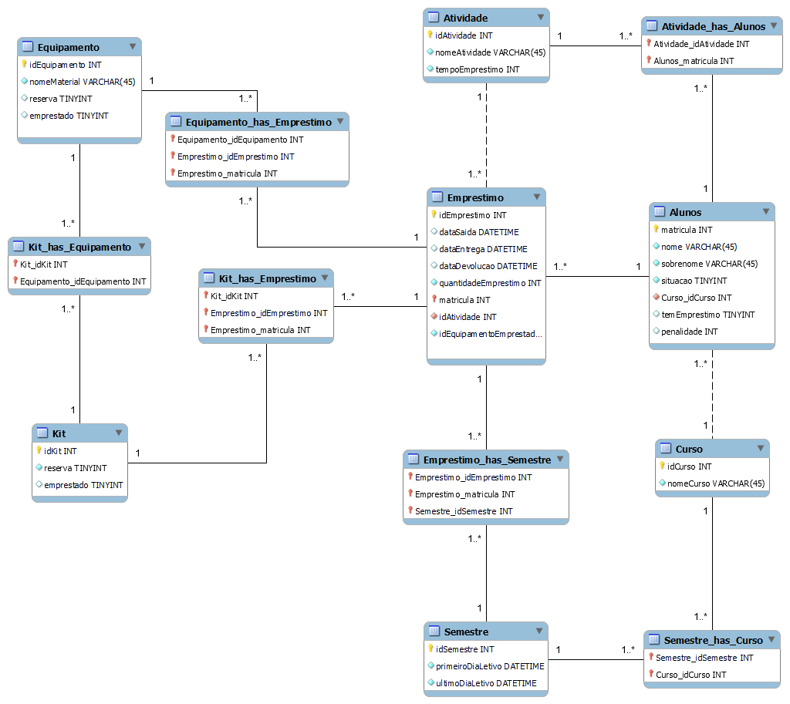

## Sistema para empréstimos de equipamentos e kit de ensino

<!--ts-->
   * [Projeto proposto](#Projeto-proposto-e-solução)
   * [Funcionalidades implementadas](#Funcionalidades-implementadas) 
   * [Digrama ER](#Diagrama-ER)
   * [Instruções para compilar e executar o projeto](#Instruções-para-compilar-e-executar-o-projeto)
     * [Compilando e executando pelo terminal com Javac](#Compilando-e-executando-pelo-terminal-com-Javac)
     * [Compilando e executando pelo terminal com Gradlew](#Compilando-e-executando-pelo-terminal-com-Gradlew)
     * [Executando arquivo jar gerado pelo InteliJ](#Executando-arquivo-jar-gerado-pelo-InteliJ)
   * [Instruções para fazer emprestimos](#Instruções-para-fazer-emprestimos)


<!--te-->

## Projeto proposto

O projeto proposto pode ser visto neste [arquivo](img/projeto1.pdf).

## Funcionalidades implementadas

<h4 align="center"> 
	🚧 Em construção...  🚧
</h4>

- [x] 
- [x] 
- [x] 
- [x] 
- [x] 
- [x] 
- [x] 
- [x] 
- [x] 
- [x] 
- [x] 
- [x] 
- [x] 
- [x] 
- [x] 
- [x] 
- [x] 


## Digrama ER

<div style="text-align:center">
   
</div>
## Instruções para compilar o projeto

### Compilando e executando pelo terminal com Javac

Estando na pasta src/main/java a classe Principal pode ser compilada da seguinte forma

```shell
    javac bcd/Principal.java 
```
Para executar basta executar o arquivo compilado

```
    java bcd.Principal 
```

### Compilando e executando pelo terminal com Gradlew

Pra compilar o projeto, é necessário ir ao diretório raiz do projeto e usar o comando:

```shell
    ./gradlew build
```
Caso ocorra tudo certo, irá retornar a mensagem <strong>BUILD SUCCESSFUL</strong> e será gerado o arquivo projeto-bcd-01-1.0-SNAPSHOT em [projeto-bcd-01/build/libs](projeto-bcd-01/build/libs).

Com o arquivo compilado pelo Gradlew, a executação do projeto pode ser feita com:

```shell
    java -cp build/libs/projeto-bcd-01-1.0-SNAPSHOT.jar bcd.Principal
```

### Executando arquivo jar gerado pelo InteliJ

O projeto em si já possui um arquivo .jar que foi gerado pela IDE e se encontram em [projeto-bcd-01/out/arifacts](projeto-bcd-01/out/artifacts). 
Para executar a classe Principal da pasta raiz será necessário usar o comando abaixo

```shell
    java -jar out/artifacts/projeto_bcd_01_main_jar/projeto-bcd-01.main.jar
```

## Instruções para fazer emprestimos

Aqui estão alguns exemplos de emprestimos para tesar as funcionalidades implementadas.


<h4 align="center"> 
	🚧 Em construção...  🚧
</h4>


129 0 emprestimo ativo 500 -> fazer emprestimo - Sucesso, 15 dias para devolução

700 123 -> renovar -> Falha, já passou da data de devolução

700 -> finalizar -> Sucesso. Gerou penalidade para aluno 123

700 0 emprestivo ativo -> fazer emprestimo - Falha, está com dias de penalidade

708 128 renovar -> Sucesso

708 128 renovar -> Sucesso

708 128 renovar -> falha, já renovou 3 vezes

703 126 finalizar - sucesso, sem penalidade

127 0 emprestimo n ativo -> falha, não está ativo no curso

125 1 emprestimo ativo -> falha, já tem um emprestimo vigente

131 0 emmprestimo ativo 501 - Sucesso, datadevolucao fim semestre